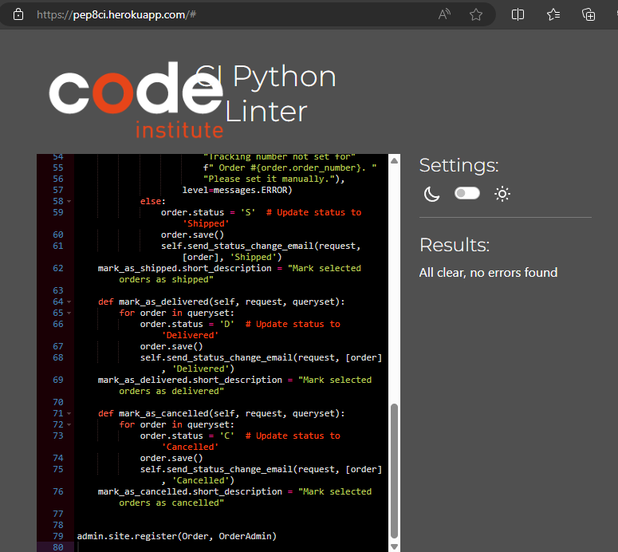
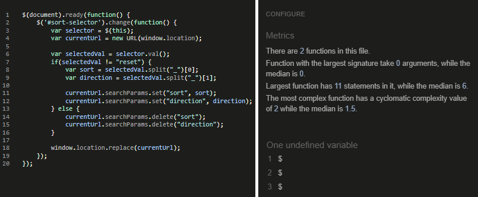

# Blossom Haven

Welcome to Burger Blast, where flavor meets delight! We're a culinary haven dedicated to crafting unforgettable experiences through sensational bites and impeccable service. This is a theoretical burger restaurant based in London, UK.

The site allows users:

- 
- 

---

## Table of contents

- [User Stories & Sprints](#user-stories)

| **[Features](#features)**                    |
| :------------------------------------------: |
| [Marketing Plan](#Marketing-Plan)            |
| [Navbar](#navbar)                            |
| [Index](#index)                              |
| [Register](#Register)                        |
| [Sign in/out](#sign-in-and-out)              |
| [Profiles](#Profiles)                        |
| [Reviews](#Reviews)                          |
| [Products List](#Products-List)              |
| [Products Details](#Products-Details)        |
| [Add & Edit Products](#Add-or-Edit-Products) |
| [Facebook Page](#Facebook-Page)              |
| [Instagram Page](#Instagram-Page)            |
| [Footer](#Footer)                            |
| [Error Pages](#error-pages)                  |
| [Django Admin](#django-admin)                |

|               **[Testing](#testing)**                |
| :--------------------------------------------------: |
| [Manual Testing](#manual-testing)                    |
| [Automated Testing](#automated-testing-scripts)      |
| [Bugs & Issues Encounterd](#bugs--issues-encountered)|

| **[Validation Testing](#validation-testing)** | 
| :-------------------------------------------: |
|               [Python](#python)               |
|           [JavaScript](#javascript)           |
|                  [CSS](#css)                  |
|                 [HTML](#html)                 |
|             [Contrast](#contrast)             |

| **[Lighthouse](#Lighthouse)** |
| :---------------------------: |
|  |

|    **[Setup](#setup)**    |
| :-----------------------: |
|   [Database](#database)   |
| [Cloudinary](#cloudinary) |
| [Deployment](#deployment) |
| [Email Setup](#Email-Setup)

|                 **More**                 |
| :--------------------------------------: |
|        [Wireframes](#wireframes)         |
|           [Credits](#credits)            |
| [Future Features](#future-feature-ideas) |

## User Stories

- User stories were stored in "Burger Blast User Stories" project of my git hub. I was a little delayed in moving them around to completion so times are a bit off although stucture of sprints were followed throughout development.

** Sprint One**

- [Setup and Basic Functionality](https://github.com/Danger0101/Blossom_Haven_CI_PP5/milestone/1?closed=1)

| **User Stories** | **Needed for MVP** | Completed |
| ------------------------------------------------------------------------------------------------------------ | :----------------: | :-------: |
| As a user, I can visit the website and see a homepage with navigation to different sections. |        Yes         |    Yes    |
| As a user I can browse different arrangements of flowers | Yes | Yes |
| As a user I can view details of a specific flower bouquet so that I can make informed buying decisions. |     Yes     | Yes |

** Sprint Two**

- [Shopping Cart and Checkout](https://github.com/Danger0101/Blossom_Haven_CI_PP5/milestone/2?closed=1)

| **User Stories** | **Needed for MVP** | Completed |
| ---------------- | :----------------: | :-------: |
| As a user I can add items to my shopping cart so that I can purchase them later. |        Yes         |    Yes    |
| As a user I can view my shopping cart so that proceeded to check out or edit my order |        Yes         |    Yes    |
| As a User or Admin I can provide my shipping and payment information to complete the purchase. |        Yes         |    Yes    |

**Sprint Three**

- [Admin Panel and Product Management](https://github.com/Danger0101/Blossom_Haven_CI_PP5/milestone/3?closed=1)

| **User Stories** | **Needed for MVP** | Completed |
| ---------------  | :----------------: | :-------: |
| As an Admin, when I add, or edit a product to where it has no product image it will show a default no image |        Yes         |    Yes    |
| As a User, when a product has no image I want to see a default no image so that I know there are no images available for this product |        Yes         |    Yes    |
| As a Admin I can view and edit existing products so that it updates and users can see the changes |        Yes         |    Yes    |
| As a admin I can Add products so that users can see and purchase them |        Yes         |    Yes    |
| As a Admin I can Login to admin panel so that I can view admin panel |        Yes         |    Yes    |

**Sprint Four**

- [Inventory Management and Stock Tracking](https://github.com/Danger0101/Blossom_Haven_CI_PP5/milestone/4?closed=1)

| **User Stories**   | **Needed for MVP** | Completed |
| ------------------ | :----------------: | :-------: |
| As a user, I want to see if products are available before adding them to the cart. |         Yes         |    Yes     | 
| As an admin, I want to manage the inventory of flowers to ensure availability. |         Yes         |    Yes     | 

**Sprint Five**

- [Add-Ons and Reviews](https://github.com/Danger0101/Blossom_Haven_CI_PP5/milestone/5?closed=1)

| **User Stories**   | **Needed for MVP** | Completed |
| ------------------ | :----------------: | :-------: |
| As a Admin, I want to be able to delete inappropriate reviews to maintain integrity of the site. |         No         |    Yes     | 
| As a User, I want to see all reviews and be able to leave a review on products I have purchased so that myself and other users can make educated purchases. |         No         |    Yes     | 
| As an Admin, I want to manage the availability and pricing of add-on items so that they can only be added if they are in stock. |         No         |    Yes     | 
| As a user, I want to add additional items to compliment my purchase. |         No         |    Yes     | 

**Sprint Six**

- [User Account and Order History](https://github.com/Danger0101/Blossom_Haven_CI_PP5/milestone/6?closed=1)

| **User Stories**   | **Needed for MVP** | Completed |
| ------------------ | :----------------: | :-------: |
| As an admin, I want to view a summary of orders and manage order statuses so that I can ensure the smooth operation and get the jump on any issues that arise. |         Yes         |    Yes     | 
| As a user, I want to create an account to track my orders and save my shipping information for future purchases. |         Yes         |    Yes     | 

**Sprint Seven**

- [The Social Media and SEO](https://github.com/Danger0101/Blossom_Haven_CI_PP5/milestone/7?closed=1)

| **User Story or Action**   | **Needed for MVP** | Completed |
| ------------------ | :----------------: | :-------: |
| As a User or Admin, when i visit the site there is a footer with links to social media and any other relevant footer links. So that I can follow them accordingly. |         Yes         |    Yes     |
| robots.txt file. and sitemap.xm |         Yes         |    Yes     |
| Newsletter Signup |         Yes         |    Yes     |
| Create Products in live database |         Yes         |    Yes     |
| HTML SEO |         Yes         |    Yes     |
| Instagram page |         No         |    Yes     |
| Facebook Bussiness page |         Yes         |    Yes     |

(MVP = Minimal Viable Product)

**Sprint Eight**

- [Testing, fixing and refactoring, Extras](https://github.com/Danger0101/Blossom_Haven_CI_PP5/milestone/8?closed=1)

---

[Back to table of contents](#Table-of-contents)

---

## Marketing Plan

- 

---

## Features

### Navbar

- 

---
### Index

- The landing page with a call to action and a soothing floral backgorund image.

---
### Register

- Django Allauth register page, allows users to make an account.

**Email link to confirm account activation and page**

---

### Forgot Password

- Django allauth page for users who forgot password and want to reset it

**Forgot Password Email**

**Forgot Pass Change Pass Page**

---

### Chnage Password

- Django Allauth change password page. Allows logged in users to change account password.

**Change Password Email**

---

### Sign In

- Django allauth sign in page, allows Users to sign into their accounts using username/Email and password.

---

### Profiles

- Allows users to view past orders and their shipping information which can be updated here.

**Change Shipping Details Email**

---

### Reviews

- Allows all visitors to view user left reviews, if logged in can create, edit, and delete their reviews

**Review Confirmation Email**

**Review Edit Confirmation Email**

**Review Delete Confirmation Email**

---

### Products List

- This page has many versions based on user search's and sort parameters. Users can see availble products sorted here with image, product name, price, and average rating.

---

### Products Details

- This is where users can view a specific product as well as the addons available. This will give a full indepth view into the product including the name (product and addons), if its availble and how many are available (product and addons), product decription, a quanity selector (product and addons), Add to cart (product and addons), and even the price (product and addons).

---

### Add or Edit Products

**Add Product**

- Here staff and super users can add new products and set all elements of the products.

**Edit Product**

- Here staff and super users can edit products and set all elements of the products.

---

### Facebook Page

- The primary location for social marketing and escentially like a second storefront.

---

### Instagram Page

- The secondary more visual only social media marketing.

---

### Footer

- Links to Social Sites, Legal, and Newsletter signup

---

### Error Pages

**400**

**403**

**404**

**500**

### Django Admin

- This is the default django admin page for more granual control of site elements.

| Login                  |                                 |
| :--------------------: | :-----------------------------: |
|  |  |

| Groups                  |                                 |
| :---------------------: | :-----------------------------: |
|  |  |

| Users                  |                                 |
| :--------------------: | :-----------------------------: |
|  |  |

| Orders                 |                                 |
| :--------------------: | :-----------------------------: |
|  |  |

| Inventory              |                                 |
| :--------------------: | :-----------------------------: |
|  |  |

| Categories             |                                 |
| :--------------------: | :-----------------------------: |
|  |  |

| Products               |                                 |
| :--------------------: | :-----------------------------: |
|  |  |

| Reviews                |                                 |
| :--------------------: | :-----------------------------: |
|  |  |

| Social accounts        |                                 |
| :--------------------: | :-----------------------------: |
|  |  |

| Social app tokens      |                                 |
| :--------------------: | :-----------------------------: |
|  |  |

| Social applications    |                                 |
| :--------------------: | :-----------------------------: |
|  |  |

---

[Back to table of contents](#Table-of-contents)

---

## Testing

### Manual Testing

**Accounts/Profiles**

| What test was completed                   | Passed? |           Other information            |
| :---------------------------------------: | :-----: | :------------------------------------: |
| Login to site as a superuser(Admin)       |   Yes   |                                        |
| Log out of site as a superuser            |   Yes   |                                        |
| Login to site as a staff (BB)             |   Yes   |                                        |
| Log out of site as a staff                |   Yes   |                                        |
| Sign up as a customer/user (John.Doe)     |   Yes   |                                        |
| Login to site as a customer/user          |   Yes   |                                        |
| Log out of site as a customer/user        |   Yes   |                                        |
| Email verification Email sent             |   Yes   |                                        |
| Can't progress with out verifying         |   Yes   |                                        |
| Forgot Password Email sent                |   Yes   |                                        |
| Link working and resets password          |   Yes   |                                        |
| Change password form                      |   Yes   | Changes the password after submission  |
| Save details check box (checkout) updates |   Yes   | Changes the form after submission      |
| Profile details page form loads           |   Yes   |                                        |
| Profile page orders made and links work   |   Yes   |                                        |
| Profile update information button works   |   Yes   | Changes the form after submission      |

**Products**

|                 What test was completed                   | Passed? | Other information   |
| :-------------------------------------------------------: | :-----: | ------------------: |
| Can add products and get a prompt confirming add          | Yes     | Staff and superuser |
| Can edit products and get a prompt confirming edit        | Yes     | Staff and superuser |
| Can remove products and get a prompt confirming deletion  | Yes     | Staff and superuser |
| All products are avialable to be viewed by everyone       | Yes     |                     |
| Can designate products as addon and they appear in addons | Yes     |                     |
| To top scroll arrow works                                 | Yes     |                     |
| Sort by A-Z                                               | Yes     |                     |
| Sort by Z-A                                               | Yes     |                     |
| Sort by rating low to high                                | Yes     |                     |
| Sort by rating high to low                                | Yes     |                     |
| Sort by price low to high                                 | Yes     |                     |
| Sort by price high to low                                 | Yes     |                     |
| View catigory nav roses                                   | Yes     |                     |
| View catigory nav vibrant                                 | Yes     |                     |
| View catigory nav Luxurious                               | Yes     |                     |
| View catigory nav all arangements                         | Yes     |                     |
| View catigory nav Valintines                              | Yes     |                     |
| View catigory nav Birthday                                | Yes     |                     |
| View catigory nav Mothers Day                             | Yes     |                     |
| View catigory nav Houswarming                             | Yes     |                     |
| View catigory nav Thank You                               | Yes     |                     |
| View catigory nav Anniversaries                           | Yes     |                     |
| View catigory nav Graduations                             | Yes     |                     |
| View catigory nav Sympathy                                | Yes     |                     |
| View catigory nav all ocassion's                          | Yes     |                     |

**Inventory**

| What test was completed                    | Passed? | Other information                     |
| :----------------------------------------: | :-----: | :-----------------------------------: |
| Can add inventory                          | Yes     | Staff and superuser                   |
| Can edit inventory                         | Yes     | Staff and superuser                   |
| Can remove inventory                       | Yes     | Staff and superuser                   |
| Inventory updates with purchases           | Yes     | Decrease as bought by correct ammount |
| Users can see the stock available          | Yes     |                                       |
| Out of stock shows visibly                 | Yes     |                                       |
| Cant add more then availble to cart        | Yes     |                                       |
| Cant checkout with more then available     | Yes     |                                       |
| Out of stock items display visual messages | Yes     |                                       |

**Cart**

|  What test was completed                   | Passed? | Other information |
| :----------------------------------------: | :-----: | :---------------: |
| Can set quantity of product to add to cart | Yes     |                   |
| Can set quanity of addons to add to cart   | Yes     |                   |
| Cant add more then allowed to cart         | Yes     |                   |
| Get a prompt when adding to cart           | Yes     |                   |
| Can view cart as superuser                 | Yes     |                   |
| Can view cart as staff                     | Yes     |                   |
| Can view cart as customer                  | Yes     |                   |
| Can update product quantity in cart        | Yes     |                   |
| Get prompt for new cart update             | Yes     |                   |
| Can remove product from cart               | Yes     |                   |
| Get prompt for new cart deletions update   | Yes     |                   |
| Cart carries over to checkout              | Yes     |                   |

**Checkout**

| What test was completed                     | Passed? | Other information |
| :-----------------------------------------: | :-----: | :---------------: |
| Cart carries over to checkout               | Yes     |                   |
| Checkout shipping info form loads           | Yes     |                   |
| Checkout strip form loads                   | Yes     |                   |
| Checkout form submits                       | Yes     |                   |
| Checkout loaing blue and white arrows loads | Yes     |                   |
| Checkout successful                         | Yes     |                   |
| Checkout unsuccessful                       | Yes     |                   |
| Checkout mssing needed information error    | Yes     |                   |
| Checkout success confirmation page          | Yes     |                   |
| Checkout success confirmation email         | Yes     |                   |
| Order shows on admin site                   | Yes     |                   |

**Reviews**

| What test was completed          | Passed? | Other information |
| :----------------- ------------: | :-----: | :---------------: |
| Make review as a customer/user   |   Yes   |                   |
| Make review as a superuser       |   Yes   |                   |
| Make review as staff             |   Yes   |                   |
| Edit review as a customer/user   |   Yes   |                   |
| Edit review as a superuser       |   Yes   |                   |
| Edit review as staff             |   Yes   |                   |
| Delete review as a customer/user |   Yes   |                   |
| Delete review as a superuser     |   Yes   |                   |
| Delete review as staff           |   Yes   |                   |
| Review creation email sends      |   Yes   |                   |
| Review edited email sends        |   Yes   |                   |
| Review deletion email sends      |   Yes   |                   |

**Admin**

| What test was completed                          | Passed? | Other information                  |
| :----------------------------------------------: | :-----: | :--------------------------------: |
| Make a super user (Admin)                        |   Yes   |                                    |
| make staff role and permissions                  |   Yes   |                                    |
| Login to Django admin as customer/user           |   Yes   | Only staff can log in successfully |
| Login to Django admin as superuser               |   Yes   | Only staff can log in successfully |
| Login to Django admin as staff                   |   Yes   | Only staff can log in successfully |
| Log out of Django admin as superuser             |   Yes   |                                    |
| Log out of Django admin as staff                 |   Yes   |                                    |
| Successfully change any users data on admin site |   Yes   |                                    |
| Superuser can visit all links                    |   Yes   |                                    |
| Staff can visit appropriate links only           |   Yes   |                                    |
| Accounts functionality working as intended       |   Yes   |                                    |
| Products functionality working as intended       |   Yes   |                                    |
| Checkout functionality working as intended       |   Yes   |                                    |
| Admin Action send order shiped email             |   Yes   | Email Recieved                     |
| Admin Action send order delivered email          |   Yes   | Email Recieved                     |
| Admin Action send order cancled                  |   Yes   | Email Recieved                     |
| Reviews functionality working as intended        |   Yes   |                                    |

### Automated Testing Scripts

- Must use local Django database for the django tests

|             Script             | Passed? |  Other information  |
| :----------------------------: | :-----: | :-----------------: |
|  |  |  |

| Script | Terminal line |
| :----: | :-----------: |
|  |  |

### Bugs & Issues Encountered

| Bugs/Issues Encountered | How problem was fixed or ammended | Fixed? |
| ----------------------- | :-------------------------------: | :----: |
|  |  |  |

---

[Back to table of contents](#Table-of-contents)

---

## Validation Testing

### Python

All Scripts checked with [PEP8 Code institute](https://pep8ci.herokuapp.com/)

**blossom_haven**

| **File**                  | **Line** | **Image**                                                                              |
| :-----------------------: | :------: | :------------------------------------------------------------------------------------: |
| blossom_haven\settings.py | All      |  |
| blossom_haven\urls.py     | All      |       |
| blossom_haven\wsgi.py     | All      |           |

**Cart**

| **File**                        | **Line** | **Image**                                                                |
| :-----------------------------: | :------: | :----------------------------------------------------------------------: |
| cart\apps.py                    | All      |          |
| cart\contexts.py                | All      |  |
| cart\urls.py                    | All      |          |
| cart\views.py                   | All      |        |
| cart\templatetags\cart_tools.py | All      |    |

**Checkout**

| **File**                    | **Line** | **Image**                                                                                          |
| :-------------------------: | :------: | :------------------------------------------------------------------------------------------------: |
| checkout\admin.py           | All      |                      |
| checkout\apps.py            | All      |                        |
| checkout\forms.py           | All      |                      |
| checkout\models.py          | All      |                    |
| checkout\signals.py         | All      |                  |
| checkout\views.py           | All      |                      |
| checkout\webhook_handler.py | All      |  |
| checkout\webhooks.py        | All      |                 |

**Home**

| **File**      | **Line** | **Image**                                                          |
| :-----------: | :------: | :----------------------------------------------------------------: |
| home\apps.py  | All      |    |
| home\urls.py  | All      |    |
| home\views.py | All      |  |

**Inventory**

| **File**             | **Line** | **Image**                                                           |
| :------------------: | :------: | :-----------------------------------------------------------------: |
| inventory\admin.py   | All      |    |
| inventory\apps.py    | All      |     |
| inventory\models.py  | All      |   |
| inventory\signals.py | All      |  |

**Products**

| **File**            | **Line** | **Image** |
| :-----------------: | :------: | :--------------------------------------------------------------: |
| products\admin.py   | All      |   |
| products\apps.py    | All      |    |
| products\forms.py   | All      |   |
| products\models.py  | All      |  |
| products\urls.py    | All      |   |
| products\views.py   | All      |   |
| products\widgets.py | All      |  |

**Profiles**

| **File**            | **Line** | **Image**                                                                         |
| :-----------------: | :------: | :-------------------------------------------------------------------------------: |
| profiles\apps.py    | All      |        |
| profiles\forms.py   | All      |      |
| profiles\models.py  | All      |    |
| profiles\signals.py | All      |  |
| profiles\urls.py    | All      |        |
| profiles\views.py   | All      |      |

**Reviews**

| **File**          | **Line** | **Image**                                                                               |
| :---------------: | :------: | :-------------------------------------------------------------------------------------: |
| reviews\admin.py  | All      |               |
| reviews\apps.py   | All      |  |
| reviews\forms.py  | All      |               |
| reviews\models.py | All      |             |
| reviews\urls.py   | All      |                 |
| reviews\views.py  | All      |               |

**Others**
     
| **File**  | **Line** | **Image**                                                      |
| :-------: | :------: | :------------------------------------------------------------: |
| manage.py | All      |  |

## Javascript

- All my custom js scripts were run though [jshint](https://jshint.com/).

| **File**                    | **Line** | **Image**                                                                               |
| :-------------------------: | :------: | :-------------------------------------------------------------------------------------: |
| Cart HTML JS                | All      |                              |
| Stripe js                   | All      |                                     |
| Async loading product image | All      |             |
| Scroll button               | All      |                             |
| Add/Edit product html js    | All      |  |
| Sortby js                   | All      |                              |
| Country Field js            | All      |                        |

---

### CSS

- checked my custom base.css with [W3 CSS Validator](https://jigsaw.w3.org/css-validator/) direct input; completed with a few warnings.

**static\css\base.css**

---

### HTML

- checked all non logged in pages as html urls and logged in pages as raw html with [W3 HTML Validator](https://validator.w3.org/) on all pages with no errors or warnings.

**Index**

### Contrast

- Checked all non logged in pages with [A11Y contrast checker](https://color.a11y.com/) Cameback with no issues.

**Index**

---

[Back to table of contents](#Table-of-contents)

---

## Lighthouse

### Index LH

| **Chrome lighthouse desktop** | **Chrome mobile lighthouse** |
| :---------------------------: | :--------------------------: |
|  |  |

### Products

**Product Add LH**

| **Chrome lighthouse desktop** | **Chrome mobile lighthouse** |
| :---------------------------: | :--------------------------: |
|  |  |

**Product Edit LH**

| **Chrome lighthouse desktop** | **Chrome mobile lighthouse** |
| :---------------------------: | :--------------------------: |
|  |  |

**Products List LH**

| **Chrome lighthouse desktop** | **Chrome mobile lighthouse** |
| :---------------------------: | :--------------------------: |
|  |  |

**Product Details LH**

| **Chrome lighthouse desktop** | **Chrome mobile lighthouse** |
| :---------------------------: | :--------------------------: |
|  |  |

### Reviews

**Product Reviews LH**

| **Chrome lighthouse desktop** | **Chrome mobile lighthouse** |
| :---------------------------: | :--------------------------: |
|  |  |

**Product Reviews Add LH**

| **Chrome lighthouse desktop** | **Chrome mobile lighthouse** |
| :---------------------------: | :--------------------------: |
|  |  |

**Product Reviews Edit LH**

| **Chrome lighthouse desktop** | **Chrome mobile lighthouse** |
| :---------------------------: | :--------------------------: |
|  |  |

### Cart LH

| **Chrome lighthouse desktop** | **Chrome mobile lighthouse** |
| :---------------------------: | :--------------------------: |
|  |  |

### Checkout

| **Chrome lighthouse desktop** | **Chrome mobile lighthouse** |
| :---------------------------: | :--------------------------: |
|  |  |

### Profiles

| **Chrome lighthouse desktop** | **Chrome mobile lighthouse** |
| :---------------------------: | :--------------------------: |
|  |  |

---

[Back to table of contents](#Table-of-contents)

---

## Setup

### Database

**Seting Up Database**

1. Go to [elephantsql](https://customer.elephantsql.com/login)
2. Make an account or sign in (I used my GitHub account)
3. Once logged in hit the "+ Create New Instance"

4. Set up a name for the plan.
5. Select version for the plan.
6. **Optional** Add any tags if you wish
7. Hit "select region" button

8. Select a Data Center.
9. Once chosen hit the "Review" button

10. If all looks correct hit "Create Instance"

11. Now you have your database set up all that is left is linking it to django project.
12. URL has a copy button hit this to copy your URL

12. Now you need to put this in your env file for the project or in your heroku config variables

**Heroku Cofig Variables**
| Key | Value |
|:---:|:-----:|
| DATABASE_URL | postgres database url |

- In the .env put it as "DATABASE_URL=your.database.url.HERE"

13. Now its linked to your project make sure to run the command to migrate all the models into your database as it is currently empty.

- Make migrations if you made any recent changes to the database models.

python manage.py makemigrations

- Migrate to move all the changes into your database.

python manage.py migrate

- There are more and other varriatons with diffrent useses [Click here to learn more (Django 5.0)](https://docs.djangoproject.com/en/5.0/topics/migrations/)

14. Now that migration is completed you are all set.
15. If you recieved an error please sort this out and then try again.

**Visualization of Databae**

- I was able to make this using [django-extensions](https://pypi.org/project/django-extensions/) and [graphviz](https://django-extensions.readthedocs.io/en/latest/graph_models.html)

**Broken apart visuals**

---

[Back to table of contents](#Table-of-contents)

---

### Cloudinary

**Creating a Cloudinary Account**

1. **Sign Up for Cloudinary:** Go to [Cloudinary's website](https://cloudinary.com/) and sign up for a new account.
2. **Verify Your Email:** Follow the instructions in the email sent to you to verify your email address.

**Integrating Cloudinary with Django**

1. **Install Cloudinary Library:** Run the following command in your terminal to install the Cloudinary Python library:

   |    run in terminal     |
   | :--------------------: |
   | pip install cloudinary |

2. **Configure Settings:** In your Django project's settings.py file, add the following configurations:

   **.env env.py or equivilent follow correct stucture for local deployment**

|                  Line to enter                  |
| :---------------------------------------------: |
|    CLOUDINARY_API_KEY = Api key value           |
| CLOUDINARY_API_SECRET = Api secret value        |
| CLOUDINARY_CLOUD_NAME = Cloudinary Name         |
| CLOUDINARY_FOLDER_NAME = Cloudinary folder name |

(Replace all after **"="** with your information)

**[Heroku](https://www.heroku.com/) Cofig Variables for live delpoyment**

|          Key           |         Value          |
| :--------------------: | :--------------------: |
|  CLOUDINARY_API_KEY    |     Api key value      |
| CLOUDINARY_API_SECRET  |    Api secret value    |
| CLOUDINARY_CLOUD_NAME  |    Cloudinary Name     |
| CLOUDINARY_FOLDER_NAME | Cloudinary Folder Name |

(Replace all **Values** with your information)

3. **Set Up Cloudinary Storage Backend:** Add the following line to settings.py to use Cloudinary as the storage backend for media files:

|                             Add to settings.py                             |
| :------------------------------------------------------------------------: |
| DEFAULT_FILE_STORAGE = 'cloudinary_storage.storage.MediaCloudinaryStorage' |

4. **Accessing Cloudinary URLs:** Whenever you upload media files in your Django application, they will automatically be stored in Cloudinary. You can access the URLs of these files to display them in your application.

5. **Optional: Resize and Manipulate Images:** Cloudinary provides various transformation options for images. You can resize, crop, and apply filters to images using Cloudinary's URL-based transformations.

6. **Testing Integration:** Upload a sample media file through your Django application and verify that it gets stored in Cloudinary.

7. **Further Customizations:** Explore [Cloudinary's documentation](https://cloudinary.com/documentation) for more advanced features and customizations, such as video processing, secure URLs, and transformation options.

8. **Congradulations you should be all set up**

---

[Back to table of contents](#Table-of-contents)

---

### Deployment

Used Heroku to deploy the website. You can [Visit Live Site by clicking here](https://blossom-haven-ci-pp5-d8c652557fbc.herokuapp.com/)

#### How to deploy to [Heroku](https://www.heroku.com/):

1. **Run Migrations:** Once your project is deployed, you'll need to run any pending database migrations. You can do this using Heroku's web-based console or by running commands in your local terminal.
2. **Create a Superuser:** If your project uses Django's admin interface, you may want to create a superuser account on Heroku. You can do this by accessing your app's shell through the Heroku dashboard and running the createsuperuser command.
3. **Create a Heroku Account:** If you haven't already, sign up for a Heroku account at heroku.com.
4. **Prepare Your Django Project:** Ensure your Django project is properly configured for deployment. This includes setting up a requirements.txt file listing all dependencies and a Procfile specifying the command to start your application.
5. **Install Gunicorn:** Gunicorn is a WSGI HTTP server for Python. You'll need to install it via pip: "pip install gunicorn"
6. **Create a Procfile:** In the root directory of your project, create a file named Procfile (without any file extension) and add the following line: web: "web: gunicorn burger_blast.wsgi:application"
7. **Update Django Settings:** Ensure your Django settings.py file is configured to work in a production environment. This includes setting DEBUG = False and adding Heroku's domain to the ALLOWED_HOSTS list.
8. **Create a requirements.txt File:** Generate a requirements.txt file listing all Python dependencies your project needs. You can create it by running: "pip freeze > requirements.txt"
9. **Create a Heroku App:** Go to the Heroku dashboard and create a new app. Choose a unique name for your app.
10. **Link GitHub Repo:** Under deploy tab in the settings link your GitHub repository.
11. **Set Up Environment Variables:** Now under settings tab set any necessary environment variables for this django project. See chart below for needed key and values.

**[Heroku](https://www.heroku.com/) Cofig Variables**

|          Key          |               Value               |
| :-------------------: | :-------------------------------: |
| DISABLE_COLLECTSTATIC |                 1                 |
|     DATABASE_URL      |       postgres database url       |
|   DJANGO_SECRET_KEY   | Django secret key for the project |
|   SENDGRID_API_KEY    |         sendgrid api key          |
|  CLOUDINARY_API_KEY   |           Api key value           |
| CLOUDINARY_API_SECRET |         Api secret value          |
| CLOUDINARY_CLOUD_NAME |          Cloudinary Name          |

(Replace all **Values** with your information)

12. **Deploy Your Project:** Back under deploy tab on Heroku scroll down to manual deploy and choose the branch you wish to deploy and hit button "Deploy Branch" wait for the success and trouble shoot if needed.

---

[Back to table of contents](#Table-of-contents)

---

### Email Setup

**Using Gmail for this site others may varry slightly**

1. Go to [Gmail](https://mail.google.com/):

- If you already have a Gmail account, you can skip this step
- If not, click on "Create account" and follow the instructions to set up a new Gmail account.

2. Sign in to your Gmail account:

- Visit [Gmail](https://mail.google.com/) and log in with your email and password.

3. [Setting up app passowrd follow these instructions](https://support.google.com/accounts/answer/185833?hl=en)

- if you dont see [app passwords](https://myaccount.google.com/apppasswords) click the link
4. Set Up the settings.py File in Django

**Add to your settings.py**

|                      Line to enter                            |
| :-----------------------------------------------------------: |
| import os (if not already imported)                           |
| EMAIL_BACKEND = 'django.core.mail.backends.smtp.EmailBackend' |
| EMAIL_USE_TLS = True                                          |
| EMAIL_PORT = 587                                              |
| EMAIL_HOST = 'smtp.gmail.com'                                 |
| EMAIL_HOST_USER = os.getenv('EMAIL_HOST_USER', '')            |
| EMAIL_HOST_PASSWORD = os.getenv('EMAIL_HOST_PASS', '')        |
| DEFAULT_FROM_EMAIL = EMAIL_HOST_USER                          |

5. Set Up Configuration Variables for Email Credentials

   **.env env.py or equivilent follow correct stucture for local development**

|    Line to enter in settings.py        |
| :------------------------------------: |
| EMAIL_HOST_USER = your_email@gmail.com |
| EMAIL_HOST_PASS = your_app_password    |

(Replace all after **"="** with your information)

**[Heroku](https://www.heroku.com/) Cofig Variables for live deployments**

|   Key           |         Value           |
| :-------------: | :---------------------: |
| EMAIL_HOST_USER | Your gamil email        |
| EMAIL_HOST_PASS | your_app_password       |

---

[Back to table of contents](#Table-of-contents)

---

## Technology used

- [HTML](https://developer.mozilla.org/en-US/docs/Web/HTML)
- [CSS](https://developer.mozilla.org/en-US/docs/Web/CSS)
- [JavaScript](https://developer.mozilla.org/en-US/docs/Web/JavaScript)
- [Fontawesome](https://fontawesome.com/)
- [Python 3.12](https://docs.python.org/3/)
- [Django 5.2](https://docs.djangoproject.com/en/5.0/)
- [Django-allauth](https://docs.allauth.org/en/latest/)
- [Visual Studios Code (VSCode)](https://code.visualstudio.com/)
- [Github](https://github.com/)
- [Git](https://git-scm.com/doc)
- [Github Desktop App](https://desktop.github.com/)
- [Cloudinary](https://cloudinary.com/documentation)
- [fooocus](https://github.com/lllyasviel/Fooocus?tab=readme-ov-file)
- [Microsoft Paint](https://www.microsoft.com/en-gb/windows/paint)
- [Gyazo](https://gyazo.com/en)
- [Microsoft Snipping tool](https://support.microsoft.com/en-us/windows/use-snipping-tool-to-capture-screenshots-00246869-1843-655f-f220-97299b865f6b)

## Wireframes

### Landing Page

## Credits

**Images**

- All images use on the website are made by [fooocus](https://github.com/lllyasviel/Fooocus?tab=readme-ov-file) which at time of writting this is a completely free AI image generator that uses your own hardware to generate images.

**More Credits**

- My wife who’s been super supportive of this change in career for me and just being out right amazing we will get her into this one way or another I am sure.

- Code Institute for providing an excellent accelerated learning platform worth every penny.

- Botique Ado walk through from code instiute as this was the basis of the project. I originally was going to expand on that but I had a spur of the moment idea for a floarist site and I think I have nailed my version of a MVP and even tweaked it some more.

- My farmers market food stall [Bokit'la](https://www.bokitla.com/) they helped insprie the project unknowingly as I told them I had this project coming up and I will possibly be helping them soon impliment shopify to their website. As a side project I want to remake their site in Django and they said do it and send it so next up is theirs. I would have done it for this but they are specifically looking for shoppify and thats possibly out side the grading for this. They got my brain thinking of ideas and Blossom Haven came out of the wood works from that.

---

[Back to table of contents](#Table-of-contents)

---

## Future feature ideas

| Feature Ideas   | Why Not Implimented               |
| :-------------: | :-------------------------------: |
| Cuppons/voucher | Time and it wasn't needed for MVP |
